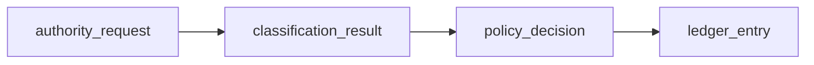

# Authority request flow (simulation-only)

## Goal

Illustrate how an agentic system should separate:
- **inference** (informational output)
- **authority** (request to act)

Core boundary:
- inference never implies authority

## Input

An `authority_request` is a structured object describing:
- `intent_summary`
- `target`
- context flags (`environment`, sensitivity hints)
- requested mode: `execute` vs `simulate` (this repository uses simulation outcomes only)

Schema:
- `schemas/authority-request.schema.json`

## Flow (conceptual)

1) Receive `authority_request` (**do not execute**).
2) Classify the request (taxonomy mapping) → produce a `classification_result`.
3) Evaluate policy (allow / deny / escalate / simulate) → produce a `policy_decision`.
4) Write a `ledger_entry` for the outcome.
5) Return simulation output only (no external effects).

## Outcomes

- `allow`: would be permitted in a real system, but remains simulation here
- `deny`: forbidden
- `escalate`: requires human oversight (no execution here)
- `simulate`: simulation-only outcome (default for many high-risk actions)

## Examples

See `examples/` for filled, cross-linked artifacts.

